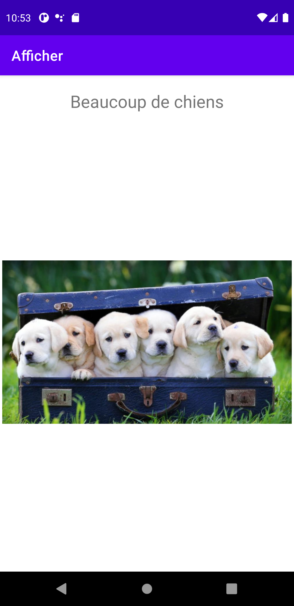

# Select and Display activity
This lab was a modification of lab 4. We used a new branch inside our lab 4 and modified it for our
lab 5 assignment. Instead of an spinner, we modified the code to use a grid view.

Our grid view displays the name and image of a dog. In addition, we also added a text view to display
instructions for the user. We use a text view because previously, we used the first position of our
spinner to display instructions.

## This is the page we see when we first launch the app

## This is the what you'll see if you click on an grid item
