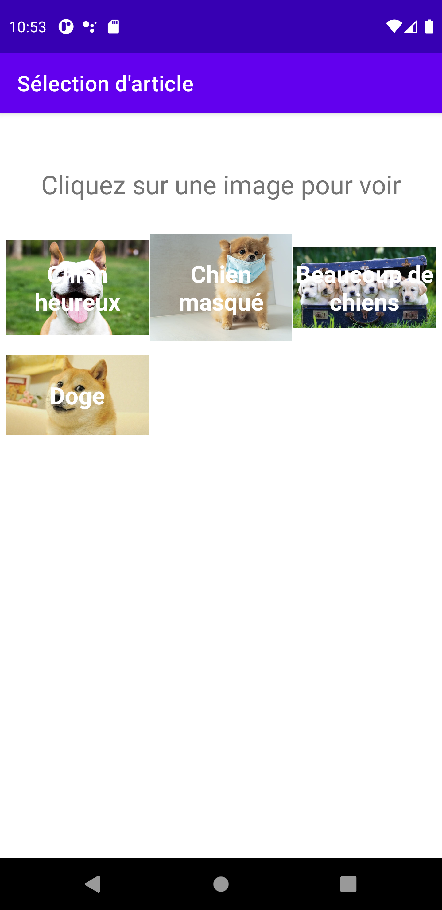

# Select and Display activity
In this lab, we modified lab 3. It was changed so that instead of displaying an image when an option
was selected from the spinner, a new activity would be started. This activity would display the
TextView and the ImageView instead of on our main page. When we click back it will display the
original home page with the instructions selected.

## This is the page we see when we first launch the app

## When you click the dropdown, this is what you get

## If you select an option, it will launch a new activity. That looks like this

## If we click the back button, we go back to the main page
